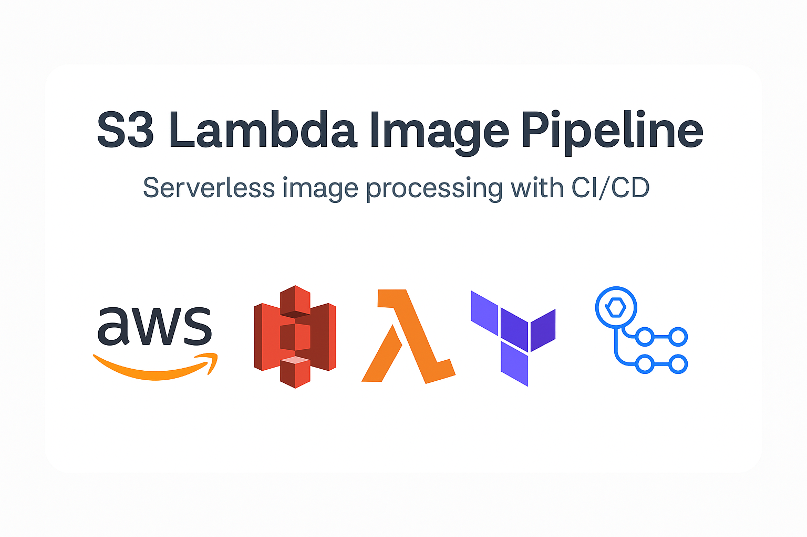
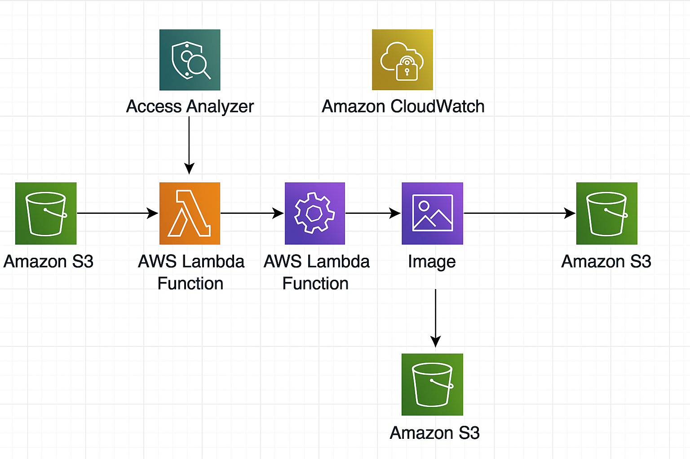
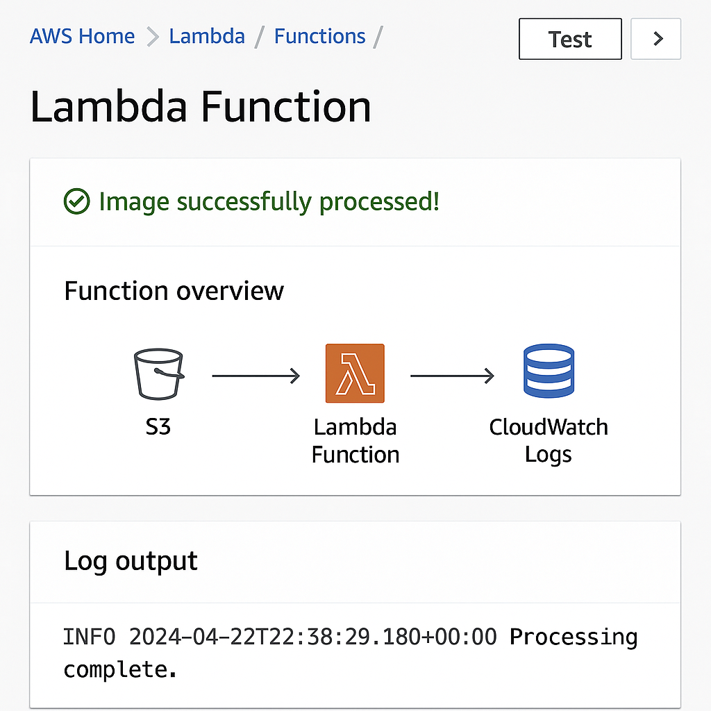

# 🖼️ S3 Lambda Image Pipeline

A serverless image processing pipeline built with AWS S3, Lambda, CloudWatch, and Python.

---

## 🔧 Architecture Overview

This project automatically processes images uploaded to S3 using Lambda and monitors behavior with CloudWatch.

---

## 🚀 Continuous Deployment with GitHub Actions

Every push to `main`:

- 🧪 Validates Terraform code  
- 🚀 Provisions AWS infrastructure  
- 🔐 Uses GitHub Secrets for AWS credentials

| Secret Name               | Description                    |
|---------------------------|--------------------------------|
| `AWS_ACCESS_KEY_ID`       | AWS access key ID              |
| `AWS_SECRET_ACCESS_KEY`   | AWS secret access key          |
| `AWS_REGION`              | AWS region (e.g., `us-east-1`) |

---

## 📂 Project Structure

s3-lambda-image-pipeline/ ├── lambda/ # Python Lambda function │ └── handler.py ├── provider.tf # AWS provider config ├── access_analyzer.tf # Access Analyzer ├── setup_terraform_aws.sh # Terraform automation └── .github/ └── workflows/ └── terraform.yml # CI/CD Workflow

yaml
Copy
Edit

---

## 🖼️ Demo & Screenshots

Mock pipeline flow:  

More screenshots coming soon!

---

## 🧪 Monitoring & Debugging

- View logs in **CloudWatch**
- Check Lambda success/failure metrics
- Use Terraform outputs to verify resources

---

## 💡 Features

- ✅ Serverless image processing
- ✅ Infrastructure as Code with Terraform
- ✅ GitHub Actions automation
- ✅ Real-time CloudWatch monitoring
